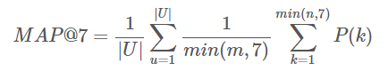

```{r setup, include=FALSE}
rm(list=ls())
knitr::opts_chunk$set(echo = TRUE, eval = FALSE)
my.install <- function(pkg) {
 if (!(pkg %in% installed.packages()[,1])) {
 install.packages(pkg)
 }
 return (require(pkg,character.only=TRUE))
}
my.install("stringr")
my.install("caret")
my.install("e1071")
my.install("rpart")
my.install("tidyr")
my.install("xgboost")
```

# Step 0: Preparation

These are some of the libraries that we use for this project, all of them will be listed here.

```{r}
library(stringr)
library(caret)
library(e1071)
library(rpart)
library(tidyr)
library(xgboost)
```

# Step 1: Observing the dataset

Before actually working with this notebook, we have done the pre-processing part in Python due to the fact that the size of the data is really big (roughly 2GB). The label is also in Spanish instead of English. We have tried our best to reformat the data to make it lighter and easier to handle in R. For the detailed description of how we reformat the data, please visit the notebook: ```ReformatData.ipynb``` using Jupyter notebook or the HTML version ```ReformatData.hmtl```. Running this notebook only requires the user to have Anaconda installed in their machine.

```{r}
data_origin = read.csv("./Data/train_ver2_processed.csv")
str(data_origin)
```

The dataset has the following field:
 
* **customer_code:** The customer unique ID
* **employee_index:** Index of the customer if he works for Santander
* **country:** Country of the customer
* **sex:** Gender of the customer
* **age:** Age of the customer
* **date_begin_contract:** The date in which the customer became first holder of contract in the bank
* **new_customer_index:** This value will be one if the customer is registered in the last 6 months
* **seniority:** Customer seniority in months
* **primary_at_month_end:** Can either be 0 (a primary customer but not at the end of the month), 1 (a primary customer till the end of the month) or -1 (Not a primary customer)
* **last_date_as_primary:** The last date in which the customer is the primary customer
* **customer_type_begin_month:** 1 (Primary), 2 (Co-owner), P (Potential), 3 (Former primary), 4 (Former co-owner)
* **relation_type_begin_month:** A (Active), I (Inactive), P (Former customer), R (Potential)
* **residence_index:** If the residence country is the same with bank country
* **foreigner_index:** If the customer's birth country is different than the bank country
* **spouse_index:** 1 if spouse of an employee
* **join_channel:** Channel by which the customer uses to join
* **deceased_index:** S = Deceased, N = No
* **address_type:** 1 = Primary Address, 0 = Not in primary address
* **province_code:** Code of the customer's province
* **province_name:** Name of the customer's province
* **activity_index:** 1 = Active, 0 = Inactive
* **gross_income:** Gross income of the household
* **segmentation:** 01 - VIP, 02 - Individuals, 03 - College Graduates

The remaining fields from Saving_Account to Direct_Debit indicates a range of products. 0 means the user doesn't have the product and 1 means the user does.

When inspecting this dataset, you might see the data in this format:

```
0|0|0|0|0|1|0|0|0|0|1|0|0|0|0|0|0
```

That is because we have tried to condense the data of 17 months into one single column to make it more convenient to store and each instance of data will be one customer, which better follows the princicples of clean data.

## Problem statement

According to the problem statement, we have to recommend products to the users *in addition* to what they already had. There are 24 products in the list. Assuming the products of a customer is as followed.

```
March:      0|0|0|0|0|0|1|0|0|0|0|0|0|0|0|0|1|0|0|0|0|1|1|1
April:      0|0|0|0|0|0|0|0|1|0|0|0|0|0|0|0|1|0|0|0|0|1|1|1
May:        0|0|0|0|0|0|1|0|1|0|0|0|0|0|0|0|0|0|1|0|0|0|1|1

Prediction: 0|0|0|0|0|0|1|0|0|0|0|0|0|0|0|0|0|0|1|0|0|0|0|0
```

Assume even further that we are only given the consumer data for only March and April and has to predict May, then the correct prediction that will generate maximum score would be as above, in which product changed from 0 to 1.

The score will be calculated as followed:



The score means that for each user, we can gain at most 1 point if we can predict all of the products that the users can add. If the user doesn't add any product, then the precision is defined to be 0.

This is an important fact because the problem doesn't require us to predict if a customer will add a product, but rather which products **if they did**. Therefore, we don't actually have to care about training data in which customers don't add anything and focuses on instances in which they actually add new data.

## Testing data

The testing data consists of 929615 instances of people. We will have to predict which product they will use for the June 2016 *in addition* to what they already have in May 2016. A simple check indicate that all of these 929615 people already exist in the original training set.

Keep in mind that there will only be score to gain if someone actually add the product. Therefore, there is a maximum number of score to be gained. For example, if only 33000 actually add product, then the maximum score possible would be 33000 / 929615 = 0.0354986


# Step 2: Clean the data

There are a lot of missing data from all kinds of field, we first need to split the data of all fields that contain data of 17 months. We will do this one attribute at the time to ensure the data doesn't get too crazy. For the list of which data attribute is actually time series, pleaase look at the file ```INFO.txt``` inside ```Documents``` folder.

```{r}
array_attributes = c("employee_index", "new_customer_index", "seniority", "primary_at_month_end", "last_date_as_primary", "customer_type_begin_month", "relation_type_begin_month", "province_code", "activity_index", "segmentation")

product_attributes = c("Saving_Account", "Guarantees", "Current_Accounts", "Derivada_Account", "Payroll_Account", "Junior_Account", "Mas_Particular_Account", "Particular_Account", "Particular_Plus_Account", "Short_Term_Deposits", "Medium_Term_Deposits", "Long_Term_Deposite", "E_Account", "Funds", "Mortgage", "Pensions_1", "Loans", "Taxes", "Credit_Card", "Securities", "Home_Account", "Payroll", "Pensions_2", "Direct_Debit")
```

We will manually fix the array attributes and fix product attributes in batch, since product attributes are very similar.

**Product attributes**

First, we need to process all the attributes of the product. The product attributes are essentially whether the customer has this particular product for 17 months. Currently, the data is in this following format.

```
Product 1                          Product 2
0|0|0|0|0|0|1|1|1|1|1|1|1|1|1|0|0  0|0|0|0|0|0|1|1|1|1|1|1|1|1|1|0|0
```

```{r}
# Make a copy of all data for the sake of safety
processed_data = data_origin

# This function is used to extract month from date
extract_month = function(date) {
  year = as.numeric(substring(date, 1, 4))
  mo   = as.numeric(substring(date, 6, 7))
  ret  = mo + (year - 2015) * 12
  if (is.na(ret)) -100
  else ret
}

# This function is used to process and fill in the blank of product data fill
process_product_data = function(s, begin_date, data_len) {
  # Get the begin month
  begin_month = extract_month(begin_date)
  
  # Get 17 months of data
  data = as.list(strsplit(as.character(s), "\\|")[[1]])
  while (length(data) < data_len) {
    # If there is no last element, strsplit will ignore it.
    # Therefore, we need to pad blank data in
    data = c(data,"")
  }
  
  # Loop through the data to fill in
  for (i in 1:data_len) {
    if (data[[i]] == "") {
      if (i == 1) data[[i]] = "0"
      else {
        if ((i > begin_month) | is.na(begin_month)) data[[i]] = data[[i-1]]
        else data[[i]] = "0"
      }
    }
  }
  
  # Reconcatenate the list into a string
  paste(data, collapse = "|")
}

# Convert all columns of the data using the new mechanism
DATA_LEN = 17
for (product in product_attributes) {
  print(product)
  processed_data[[product]] = mapply(process_product_data, processed_data[[product]], processed_data[["date_begin_contract"]], DATA_LEN)
}
```

**Employee index**

Employee index indicates whethere this customer is an employee working at Santander. There is only roughly 500 customers who are actually employees. And we should also think that it is very unlikely that the customer quits their job during the time span of 17 months. Therefore, we only need to represent this information once instead of for 17 months.

```{r}
get_one_data = function(s) {
    data = as.list(strsplit(as.character(s), "\\|")[[1]])
    
    # If any piece of data is different from empty string, return that
    for (i in 1:length(data)) {
        if (data[[i]] != "") return(data[[i]])
    }
    # Otherwise, return NA
    NA
}

processed2 = processed_data
processed2$employee_index = mapply(get_one_data, processed2$employee_index)
```

**New customer index**

New customer index has the same problem with product attributes, except that the data_begin_contract should not matter for this attribute. We can therefore process all these data the same way we process other product attributes

```{r}
processed3 = processed2
processed3$new_customer_index = mapply(process_product_data, processed3$new_customer_index, "", DATA_LEN)
```

**Seniority**

Seniority has an interesting bug. By definition, it should be the number of months in contract for each customer. For some reason, the first 7 months of data stay the same. This is probably a bug in the data. We observe that:

* The first 7 months should be fixed to project a linear progression of data
* Since all data progress the same, we can just pick the seniority of the last month for the field instead of storing data for all 17 months.

```{r}
fix_seniority = function(s, data_len) {
  # Get 17 months of data
  data = as.list(strsplit(as.character(s), "\\|")[[1]])
  while (length(data) < data_len) {
    # If there is no last element, strsplit will ignore it.
    # Therefore, we need to pad blank data in
    data = c(data,"")
  }
  
  for (i in 1:data_len) {
    if (data[[i]] != "") {
      # If we found data in the first 7 months, add 10
      if (i <= 7) return(as.numeric(data[[i]]) + 10)
      else return(as.numeric(data[[i]]) + data_len - i) # Else, just add the remaining number of month
    } 
  }
}
processed4 = processed3
processed4$seniority = mapply(fix_seniority, processed4$seniority, DATA_LEN)
```

**primary_at_month_end, customer_type_begin_month, relation_type_begin_month, activity_index**

These are also time series data that have fields that lack data. We can process this data similar to the product attributes. However, the default value to fill in need to change depending on which kind of data we are processing. For example, default value for activity index should be "I" for "Inactive" instead of "0". Because of this reason, we will write a new function for these kinds of data.

```{r}
# This function is used to process and fill in the blank of product data fill
process_time_series_data = function(s, begin_date, data_len, default_value) {
  # Get the begin month
  begin_month = extract_month(begin_date)
  
  # Get 17 months of data
  data = as.list(strsplit(as.character(s), "\\|")[[1]])
  while (length(data) < data_len) {
    # If there is no last element, strsplit will ignore it.
    # Therefore, we need to pad blank data in
    data = c(data,"")
  }
  
  # Loop through the data to fill in
  for (i in 1:data_len) {
    if (data[[i]] == "") {
      if (i == 1) data[[i]] = default_value
      else {
        if ((i > begin_month) | is.na(begin_month)) data[[i]] = data[[i-1]]
        else data[[i]] = default_value
      }
    }
  }
  
  # Reconcatenate the list into a string
  paste(data, collapse = "|")
}

processed5 = processed4
processed5$primary_at_month_end = mapply(process_time_series_data, processed5$primary_at_month_end, "", DATA_LEN, "1") # Assume 1 (Primary)
processed5$customer_type_begin_month = mapply(process_time_series_data, processed5$customer_type_begin_month, "", DATA_LEN, "1") # Assume 1 (Primary)
processed5$relation_type_begin_month = mapply(process_time_series_data, processed5$relation_type_begin_month, "", DATA_LEN, "I") # Assume I (Inactive)
processed5$activity_index = mapply(process_time_series_data, processed5$activity_index, "", DATA_LEN, "0") # Assume 0 (Inactive)
```

**Gross income**

Gross income is lacking in many instances of data. We can try to fill this by using the median income of the city that the resident is currently living in.

```{r}
# Copy the df
processed6 = processed5

# Take out necessary data for calculating median income
processed6[is.na(processed6$province_code), "province_code"] = -1
incomes_by_city = processed6[, c("gross_income", "province_code")]
unique_provinces = unique(processed6$province_code)

# Calculate the median for each province code and fill that in incomes by city
for (p in unique_provinces) {

  if (p == 1) {
    incomes_by_city = processed6[processed6$province_code == 26, "gross_income"]
    median_income = median(incomes_by_city, na.rm = TRUE)
  } else {
    incomes_by_city = processed6[processed6$province_code == p, "gross_income"]
    median_income = median(incomes_by_city, na.rm = TRUE)
  }
  
  print(paste(p, median_income))
  # After calculating the median income of the city, fill it in the blank data field
  processed6[(is.na(processed6$gross_income)) & (processed6$province_code == p), "gross_income"] = median_income
}
```

**Segmentation**

After observing segmentation attributes, we saw that segmentation is also a time series that can change over time. One customer can switch their segmentation between 01 - VIP, 02 - INDIVIDUALS, or 03 - COLLEGE GRADUATES. It is very hard to actually to fill in the data because we can't assume any "default" type for a customer. The way we do it is as followed

```
_|_|_|1|1|1|_|1|2|_|_|_|_|_|3|_|_

* If the first month is blank, keep going until we found one information about the customer.
* If any month other than first month is blank, use the data of the last month to fill, assuming that the status has not been changed
* If there is no information in all month, we will remove the entire instance of users. This will be done in later part of the workbook.

1|1|1|1|1|1|1|1|2|2|2|2|2|2|3|3|3
```

```{r}
# Copy processed6
processed7 = processed6

# This function is used to process and fill in the blank of product data fill
process_time_series_data2 = function(s, begin_date, data_len, default_value) {
  # Get the begin month
  begin_month = extract_month(begin_date)
  
  # Get 17 months of data
  data = as.list(strsplit(as.character(s), "\\|")[[1]])
  while (length(data) < data_len) {
    # If there is no last element, strsplit will ignore it.
    # Therefore, we need to pad blank data in
    data = c(data,"")
  }
  
  # If the first month has no data
  if (data[[1]] == "") {
    # Run through till we find data
    for (i in 2:data_len) {
      if (data[[i]] != "") {
        fill_data = data[[i]]
        # If found something different than NA, fill back and break
        for (j in 1:i) data[[j]] = fill_data
        break
      } else if ((data[[i]] == "") & (i == 17)) {
        # If there is absolutely no data throughout
        fill_data = "01"
        for (j in 1:data_len) data[[j]] = fill_data
        break
      }
    }
  }
  
  # Loop through the data to fill in
  for (i in 1:data_len) {
    if (data[[i]] == "") {
      if (i == 1) data[[i]] = default_value
      else {
        if ((i > begin_month) | is.na(begin_month)) data[[i]] = data[[i-1]]
        else data[[i]] = default_value
      }
    }
  }
  
  # Reconcatenate the list into a string
  paste(data, collapse = "|")
}

# Process the segmentation
processed7$segmentation = mapply(process_time_series_data2, processed7$segmentation, "", DATA_LEN, "1")
```

**Last date as primary**

This is tricky data to fill. Most of the data field should be blank because customer usually don't end the primary. It is also even possible for a customer to end as primary TWICE (They end the primary, reactive to become primary again and then end it). There are a few ways to fix this data

* Keep all data as is and fill NA for date that is lacking
* Keep only the last time that the user actually leaves. If the user never leaves, put NA
* Keep only the MONTH of the last time the user leaves. If the user never leaves, put NA

It seems that the most logical way to fill in this data would be to use the MONTH. Using month seems to be a more helpful way to indicate when the user leaves and it takes less space. There is only 17 variation of the MONTH data (from 1 to 17) so it is better for machine learning method to process.

However, since the data is so scarce it is better just not to use this piece of data into a model. Removing this attribute will be done in the later part of building the model.

## Remapping data to numerals

One of the model that we will use is called XGBoost, which requires all data to be numerals. Therefore, we will remap all character data into numerals to help this particular training model.

```{r}
remap_data = function(s, translate_vec, na_rep) {
  if (s == "" | is.na(s)) {
    ret = na_rep
  } else {
    ret = translate_vec[[s]]
  }
  ret
}

remap_data_time = function(s, translate_vec, na_rep, data_len) {
  # Get 17 months of data
  data = as.list(strsplit(as.character(s), "\\|")[[1]])
  while (length(data) < data_len) {
    # If there is no last element, strsplit will ignore it.
    # Therefore, we need to pad blank data in
    data = c(data,"")
  }

  # For loop to translate
  for (i in 1:data_len) {
    if (data[[i]] == "" | is.na(data[[i]])) {
      data[[i]] = na_rep
    } else {
      data[[i]] = translate_vec[data[[i]]]
    }
  }
  
  # Reconcatenate the list into a string
  paste(data, collapse = "|")
}

# Residence dict
res_translate = c(1, 0, 1)
names(res_translate) = c("NA", "N", "S")

# employee_index dict
emp_ind_translate = c(3, 0, 1, 2, 3, 4)
names(emp_ind_translate) = c("NA", "A", "B", "F", "N", "S")

# sex_dict
sex_translate = c(2, 0, 1)
names(sex_translate) = c("NA", "H", "V")

# spouse_index
spouse_translate = c(0, 0, 1)
names(spouse_translate) = c("NA", "N", "S")

# deceased_index
deceased_translate = c(0, 0, 1)
names(deceased_translate) = c("NA", "N", "S")

# relation_type
relation_translate = c(1, 0, 1, 2, 3, 4)
names(relation_translate) = c("NA", "A", "I", "P", "R", "N")
```

We will use ```remap_data``` if the attribute is not time series.

```{r}
# Copy processed7
processed8 = processed7

# Translate all fields with characters
processed8$employee_index = sapply(processed8$employee_index, remap_data, emp_ind_translate, emp_ind_translate[["NA"]])
processed8$sex = sapply(processed8$sex, remap_data, sex_translate, sex_translate[["NA"]])
processed8$residence_index = sapply(processed8$residence_index, remap_data, res_translate, res_translate[["NA"]])
processed8$spouse_index = sapply(processed8$spouse_index, remap_data, spouse_translate, spouse_translate[["NA"]])
processed8$deceased_index = sapply(processed8$deceased_index, remap_data, deceased_translate, deceased_translate[["NA"]])
```

And we will use ```remap_data_time``` if the attribute is time series.

```{r}
# Translate all fields with string
processed8$relation_type_begin_month = sapply(processed8$relation_type_begin_month, remap_data_time, relation_translate, relation_translate[["NA"]], DATA_LEN)
```

# Step 3: Building the model

The problem statement doesn't ask us to predict whether the customers add product or not, but rather what kinds of products they add *if they do*.

This is a very important point. There is essentially no harm in predicting the wrong products for the users who don't add any, but severe punishment for doing so for the users who do add products. Therefore, we will only need to train models on the users who actually add the product and ignore those who don't.

We have to predict what product the users will add in June 2016. Since there is certain correlation between the product and month, it would make sense to use products added in June 2015 as our training labels. This make Jan - May 2015 our training data and Jan - May 2016 our testing data.

We already prepared a file called ```change_5_6_2015.csv```, which indicates the change of products of from May to June 2015. There are roughly 33318 people who actually add more products from May to June, which makes 33318 instances of training data.

```{r}
change_5_6 = read.csv("./Data/change_5_6_2015.csv")

code_indices = change_5_6$customer_code
train_data = processed8[processed8$customer_code %in% code_indices, ]
```

At this point, we already have clean data for each attributes. Let's take the first five months of data to make a training set.

```{r}
# List all time attributes
time_attributes = c("new_customer_index", "primary_at_month_end", "customer_type_begin_month", "relation_type_begin_month", "activity_index", "segmentation", "Saving_Account", "Guarantees", "Current_Accounts", "Derivada_Account", "Payroll_Account", "Junior_Account", "Mas_Particular_Account", "Particular_Account", "Particular_Plus_Account", "Short_Term_Deposits", "Medium_Term_Deposits", "Long_Term_Deposite", "E_Account", "Funds", "Mortgage", "Pensions_1", "Loans", "Taxes", "Credit_Card", "Securities", "Home_Account", "Payroll", "Pensions_2", "Direct_Debit")

# Copy the train_data
train_data2 = train_data

# Take only the first 5 months of data
for (att in time_attributes) {
  print(att)
  train_data2[[att]] = mapply(str_extract, train_data2[[att]], "[^\\|]+\\|[^\\|]+\\|[^\\|]+\\|[^\\|]+\\|[^\\|]+")
}
```

After getting the first five months. We will split each product data into five columns.

```{r}
# Function to generate column name
gen_col_names = function(s, a, b) {
  name_list = c()
  for (i in a:b) {
    name_list = c(name_list, paste(s,i,sep="_"))
  }
  name_list
}

# Clone the train_data
train_data3 = train_data2

# Seperate all time series attributes
for (att in time_attributes) {
  train_data3 = separate_(train_data3, att, gen_col_names(att, 1, 5), "\\|", convert = TRUE)
}
```

train_data3 contains some product attributes that have NA value at certain months. We will fix each attribute individually.

**Product attributes:** Since we can't assume whether the user has the product or not, we will fill these values at 0.

```{r}
# Process train_data_3 to remove all NA values
num_NAs = colSums(is.na(train_data3)) # This contains the number of NA in each column

# Fix all product attributes
train_data_clean = train_data3
train_data_clean[,48:167][is.na(train_data_clean[,48:167])] = 0

# At this point, there should be no NA in the dataset
train_data3 = train_data_clean
```

Some data is artifact of the new dataform. They include data for all 17 months while only one month is needed. For example:

**last_date_as_primary:** Only the first piece of data is needed because once the user stop being primary, they never go back beign a primary customer again. This data is also fairly messey and is already indicated partially with the ```primary_at_month_end``` column. Therefore, we will leave it as is.

Select the columns that we will actually use for training the data

```{r}
Drop_Column_List = c("customer_code", "last_date_as_primary", "foreigner_index", "date_begin_contract", "join_channel", "country", "province_name", "customer_type_begin_month_1", "customer_type_begin_month_2", "customer_type_begin_month_3", "customer_type_begin_month_4", "customer_type_begin_month_5")
```

Prepare the training data set

```{r}
trainList = list()

train_data4 = train_data3[, !(names(train_data3) %in% Drop_Column_List)]
train_data4$province_code[train_data4$province_code == -1] = 100
# Create all training data
for (i in 1:length(product_attributes)) {
  train = train_data4
  train$train_labels = as.numeric(change_5_6[[product_attributes[i]]])
  trainList[[i]] = train
}
```

Get the test data

```{r}
test_ver2 = read.csv("Data/test_ver2.csv")
code_indices_test = test_ver2$ncodpers

test_data = processed8[processed8$customer_code %in% code_indices_test, ]
```

For the testing data set, we will take the last 5 months data, which represent the product data from Jan 2016 to May 2016

```{r}

# Copy the train_data
test_data2 = test_data

# Take only the first 5 months of data
for (att in time_attributes) {
  print(att)
  test_data2[[att]] = mapply(str_extract, test_data2[[att]], "[^\\|]+\\|[^\\|]+\\|[^\\|]+\\|[^\\|]+\\|[^\\|]+$")
}
```

Split them into five columns

```{r}
# Clone the test_data
test_data3 = test_data2

# Seperate all time series attributes
for (att in time_attributes) {
  print(att)
  test_data3 = separate_(test_data3, att, gen_col_names(att, 1, 5), "\\|", convert = TRUE)
}
```

And drop unnecessary column so that train_data and test_data have the same format.

```{r}
test_data4 = test_data3[, !(names(test_data3) %in% Drop_Column_List)]
test_data4$province_code[test_data4$province_code == -1] = 100
```

## Model building strategy

We decided that we will build a model for each product. There are 24 products available for the customer to purchase, which require 24 models. Each model will return a probability of whether this product will be added. We will have a list of 24 probabilities and we will pick the top 7 (aside from the products that the users already owned) as our predictions.

*What if all probabilities are two low?* In that case, we will build a simple list of the most popular products. If any product in the top 7 has probability that fall below certain threshold, we will simply replace that by a popular product that has not yet been owned.

```{r}
train_control = trainControl(method = "cv", number=10,savePredictions = T,summaryFunction = twoClassSummary,classProbs = T)
modelList = list()
pmt = proc.time()
for (i in 1:length(product_attributes)) {
  print(product_attributes[i])
  if (sum(trainList[[i]]$train_labels == "yes") != 0) {
    model = train(train_labels ~ ., data=trainList[[i]], trControl=train_control, method="rpart",metric="ROC", na.action = na.pass)
    modelList[[i]] = model
  }
}
show(proc.time() - pmt)
```

Using the model to predict on the testing data set.

```{r}
pmt = proc.time()
predList = list()
empty_df = data.frame(x = rep(0, times = nrow(test_data4)))
rownames(empty_df) = rownames(test_data4)
for (i in 1:length(product_attributes)) {
  print(product_attributes[i])
  if (is.null(modelList[[i]])) {
    predList[[i]] = empty_df
  } else {
    pred = predict(modelList[[i]],test_data4,type="prob")
    
    #Figure out differences in indices
    indices_diff = setdiff(rownames(empty_df), rownames(pred))
    pred[indices_diff, "yes"] = 0
    pred = pred[rownames(empty_df),]
    pred$no = NULL
    
    # Assign pred to pred list
    predList[[i]] = pred
  }
  colnames(predList[[i]]) = c(product_attributes[i])
}
show(proc.time() - pmt)

#Binding all the different columns. Pred_df now represents the probability prediction for all 24 products for all customers.
pred_df = do.call(cbind, predList)
pred_df$customer_code = test_data3$customer_code
```

**Building the popular product set:** Find all the most popular products in 2 months (06/2015 and 05/2015), replacing the products that gets predicted from the model with too low probability.

```{r}
popular_data = processed6[,product_attributes]
popular_data$customer_code = processed6$customer_code
for (att in product_attributes) {
  print(att)
  popular_data[[att]] = mapply(str_extract, popular_data[[att]], "[^\\|]+$")
}
popular_count_5_16 = apply(popular_data, 2, function(x) {sum(x == "1")})

sorted_popular_count_5_16 = sort(popular_count_5_16, decreasing = TRUE)
```

Convert from probability matrix into product recommendation, following the competition's format. The following code describe two ways of selecting models.

* **getTop7andPopular:** This will select the top 7 products that the user hasn't yet owned. If any product in this top 7 falls below a certain threshold, then the product will be replace by the most popular product that the user hasn't yet owned.
* **getTop7:** We predict in the similar top 7 manner, except that popular products will hold no weight in the process of decision making.

```{r}
product_names_es = c("ind_ahor_fin_ult1","ind_aval_fin_ult1","ind_cco_fin_ult1","ind_cder_fin_ult1","ind_cno_fin_ult1","ind_ctju_fin_ult1","ind_ctma_fin_ult1","ind_ctop_fin_ult1","ind_ctpp_fin_ult1","ind_deco_fin_ult1","ind_deme_fin_ult1","ind_dela_fin_ult1","ind_ecue_fin_ult1","ind_fond_fin_ult1","ind_hip_fin_ult1","ind_plan_fin_ult1","ind_pres_fin_ult1","ind_reca_fin_ult1","ind_tjcr_fin_ult1","ind_valo_fin_ult1","ind_viv_fin_ult1","ind_nomina_ult1","ind_nom_pens_ult1","ind_recibo_ult1")
names(product_names_es) = product_attributes

getTop7andPopular = function(x) {
  chosen7 = ""
  product_included = 0
  
  threshold = 0.01
  exclude_product = c()

  customer = popular_data2[x["row_id"],]
  for (att in product_attributes) {
    if (customer[att] == "1") {
      x[att] = 0
      exclude_product = append(exclude_product, att)
    }
    if (x[att] > threshold) {
      exclude_product = append(exclude_product, att)
    }
  }
  model_prob = sort(x[1:24], decreasing = TRUE)
  popular_products = setdiff(names(sorted_popular_count_5_16), exclude_product)
  
  for (att in names(model_prob)) {
    if (model_prob[att] > threshold) {
      chosen7 = paste(chosen7, product_names_es[att], collapse=' ')
    } else {
      #We met the probabilities that are under the thresholds
      chosen7 = paste(chosen7, paste(product_names_es[popular_products[1:(7 - product_included)]], collapse=' '), collapse=' ')
      break
    }
    product_included = product_included + 1
    if (product_included>=7) {
      break
    }
  }
  return(substring(chosen7, 2))
}

getTop7 = function(x) {
  colIndex = tail( order(x[1:24]), 7 )
  paste(product_names_es[colIndex], collapse = ' ')
}


popular_data2 = popular_data[popular_data$customer_code %in% pred_df$customer_code,]
```

Calling getTop7andPopular on our probability matrix, row by row to obtain the final prediction.

```{r}
pmt = proc.time()
pred_df$row_id = 1:nrow(pred_df)
top7 = apply(pred_df, 1, getTop7andPopular)
show(proc.time() - pmt)

```

Export the prediction to a CSV file to obey the rule of the Kaggle competition.

```{r}
submit_df = data.frame(ncodpers = pred_df$customer_code, added_products = top7)
write.csv(submit_df, file="Data/Pham_Phan_Submit.csv", row.names = FALSE)

```

This model has already performed decently well as is with a relatively simple technique of decision tree.


But we decided to not stop there and keep trying to improve our score. This leads to the next section.

# Step 4: Using XGBoost

XGBoost is a package implementing Boosted Tree model recently mainly by Tianqi Chen. This model has been the recent top performers for many Kaggle competitions. We are very glad that we discovered this model and that this model has an R wrapper API. This package is incredibly efficient for the fact that it can take advantage of parallelism and use all the cores in the CPU. The training time for all 24 models are also incredibly efficient (It takes only 2 minutes to train all 24 models! with 100 iterations each). We highly recommend mention of this tool for the course in the future, especially for classification and regression tasks.

```{r}
set.seed(100)
pmt = proc.time()
modelList = list()
for (i in 1:length(product_attributes)) {
  print(product_attributes[i])
  df_train = trainList[[i]]
  y = df_train$train_labels
  df_train = df_train[-grep('train_labels', colnames(df_train))]
  
  if (sum(y) != 0) {
    model = xgboost(data = as.matrix(df_train), 
            label = y, 
            eta = 0.05,
            max_depth = 5, 
            nround=100, 
            subsample = 1,
            colsample_bytree = 1,
            seed = 100,
            eval_metric = "logloss",
            objective = "binary:logistic",
            num_class = 1,
            missing = NaN,
            silent = 1
          )
    modelList[[i]] = model
  }
}
show(proc.time() - pmt)
```

We will discuss performance of this method. The workbook is run on machine with Intel Core i7-5820K CPU @3.3GHz (Hyperthreaded 12 logical cores), and 32GB DDR4 Memory. The training task is CPU-intensive and uses all the available resources to parralelize.


After training 24 models, we will predict in the similar manner.

```{r}
pmt = proc.time()
predList = list()
empty_df = data.frame(x = rep(0, times = nrow(test_data4)))
rownames(empty_df) = rownames(test_data4)
df_test = as.matrix(test_data4)

for (i in 1:length(product_attributes)) {
  print(product_attributes[i])
  if (is.null(modelList[[i]])) {
    predList[[i]] = empty_df
  } else {
    y_pred <- predict(modelList[[i]], df_test, missing=NaN)
    # Assign pred to pred list
    predList[[i]] = data.frame(y = y_pred)
  }
  colnames(predList[[i]]) = c(product_attributes[i])
}

pred_df = do.call(cbind, predList)
pred_df$customer_code = test_data3$customer_code
show(proc.time() - pmt)
```

The prediction task is Memory-intensive and involves many RAM-Disk swapping optimization.


Again, we will call getTop7andPopular to wipe out some products with low probability.
```{r}
pmt = proc.time()
pred_df$row_id = 1:nrow(pred_df)
top7 = apply(pred_df, 1, getTop7andPopular)
show(proc.time() - pmt)
```

Export the prediction to a CSV file to obey the rule of the Kaggle competition.

```{r}
submit_df_2 = data.frame(ncodpers = pred_df$customer_code, added_products = top7)
write.csv(submit_df_2, file="Data/Pham_Phan_Submit_12.csv", row.names = FALSE)

```

Most recently, our submission earned us a good standing on the Kaggle competition (Top 10%).


